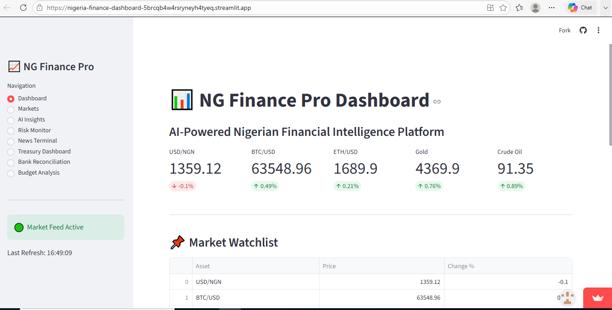
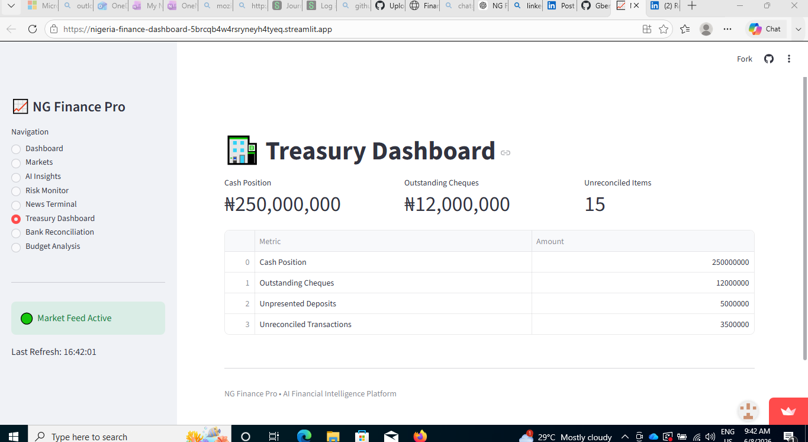
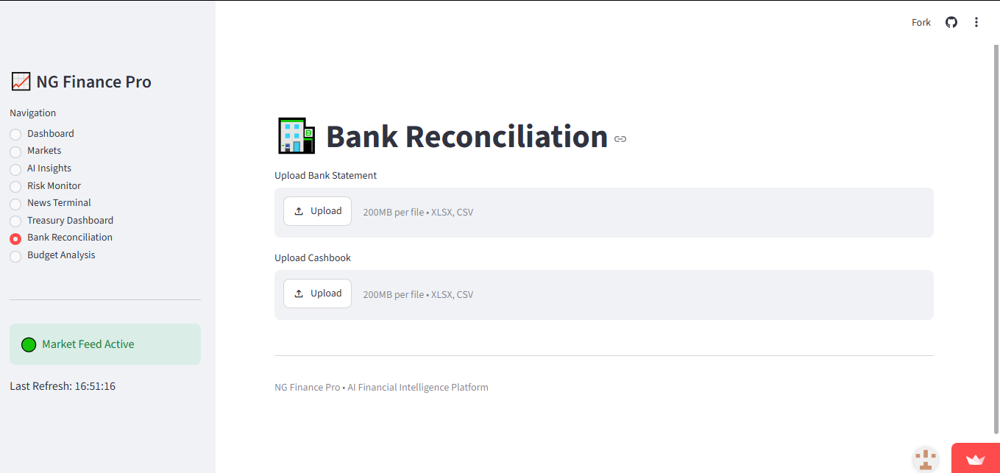

# NG Finance Pro 📈

## Overview

NG Finance Pro is an AI-powered Financial Intelligence and Treasury Management Platform developed using Python and Streamlit.

The platform combines market intelligence, treasury monitoring, budget analysis, and financial analytics into a single dashboard designed for finance professionals, treasury analysts, accountants, investors, and business managers.

## Project Objective

NG Finance Pro was developed to provide investors, accountants, treasury professionals, and finance managers with a centralized platform for financial intelligence and decision support.

The long-term objective is to enable users to upload company financial statements and automatically receive:

- Financial ratio analysis
- Liquidity assessment
- Profitability assessment
- Solvency assessment
- Financial health scoring
- Investment recommendations
- Company comparison reports

This project combines Accounting, Treasury Management, Financial Engineering, Data Analytics, and Artificial Intelligence into a single decision-support platform.
---

## Features

### Market Intelligence

* Live USD/NGN Exchange Rate Monitoring
* Bitcoin Market Tracking
* Ethereum Market Tracking
* Gold Price Monitoring
* Crude Oil Price Monitoring
* Interactive Market Charts
* AI-Generated Market Insights
* Live Financial News Feed

### Treasury Dashboard

* Cash Position Monitoring
* Outstanding Cheques Tracking
* Unpresented Deposits Monitoring
* Unreconciled Transactions Monitoring

### Bank Reconciliation

* Upload Bank Statements
* Upload Cashbook Files
* Excel and CSV Support
* Foundation for Automated Reconciliation

### Budget vs Actual Analysis

* Budget Monitoring
* Variance Analysis
* Departmental Performance Review
* Visual Budget Reporting

---

## Technology Stack

* Python
* Streamlit
* Pandas
* Plotly
* yFinance
* News API
* GitHub
* Streamlit Cloud

---

## Screenshots

### Dashboard

### Treasury Dashboard

### Bank Reconciliation

### Budget Analysis

![Budget Analysis](screenshots/budget-analysis.PNG

## Current Development Status

Version: 1.0

Completed Modules:

✅ Market Intelligence Dashboard

✅ Treasury Dashboard

✅ Bank Reconciliation Upload System

✅ Budget vs Actual Analysis

✅ AI Market Insights

✅ Financial News Terminal

In Development:

🚧 Financial Statement Analyzer

🚧 Financial Health Score Engine

🚧 Automated Reconciliation Engine

🚧 Investment Research Assistant
---

## Future Roadmap

### Phase 1
- Financial Statement Analyzer
- Ratio Analysis Engine
- Financial Health Scoring
- Investor Recommendation Engine

### Phase 2
- Automated Bank Reconciliation
- Cash Flow Forecasting
- Treasury Risk Dashboard
- Liquidity Monitoring

### Phase 3
- PDF Annual Report Analysis
- AI Investment Research Assistant
- Company Comparison Tool
- Valuation Dashboard

### Phase 4
- Portfolio Analytics
- Stock Screening Engine
- Credit Risk Modelling
- Financial Forecasting Models
---

## Author

Gbenga Olufisayo

Accountant | Treasury Professional | Financial Engineering Enthusiast

---

## Live Application

Streamlit Deployment Link

https://nigeria-finance-dashboard-5brcqb4w4rsryneyh4tyeq.streamlit.app/
